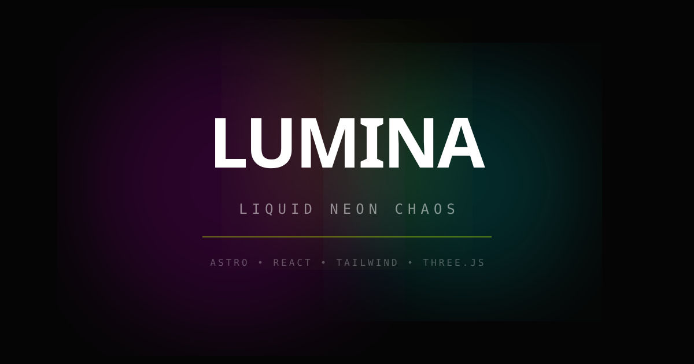

# Lumina — Liquid Neon Chaos

A high-intensity, WebGL-powered Astro template with fluid animations, neon aesthetics, and interactive effects. Built with Astro, React 19, Tailwind CSS v4, Framer Motion, and Three.js.

[](https://astro.build)
[](https://tailwindcss.com)
[](https://react.dev)
[](./LICENSE)



---

## Features

- **WebGL Fluid Background** — Real-time shader-based fluid simulation with mouse interaction, automatic CSS fallback
- **Custom Cursor** — Spring-animated cursor ring with spotlight and trailing dot (fine-pointer only)
- **Smooth Scroll** — Lenis-powered buttery smooth scrolling
- **Framer Motion Animations** — Scroll-triggered reveals, parallax text, magnetic buttons, card tilt effects
- **Melting Typography** — SVG filter-based text distortion with hover effects
- **Preloader** — Animated loading screen with progress bar
- **11 Sections** — Hero, About, Features, Portfolio, Pricing, Testimonials, FAQ, CTA, Contact, Footer, 404
- **Fully Responsive** — Optimized for 300px–2560px+ screen widths
- **Accessible** — `prefers-reduced-motion` support, focus-visible styles, semantic HTML, ARIA attributes
- **SEO Ready** — Sitemap, Open Graph, Twitter Cards, structured data, canonical URLs

## Tech Stack

| Technology | Purpose |
|---|---|
| [Astro 6](https://astro.build) | Static site framework with islands architecture |
| [React 19](https://react.dev) | Interactive component islands |
| [Tailwind CSS v4](https://tailwindcss.com) | Utility-first styling via Vite plugin |
| [Framer Motion](https://motion.dev) | Declarative animations and gestures |
| [Three.js](https://threejs.org) + React Three Fiber | WebGL background shader |
| [Lenis](https://lenis.darkroom.engineering) | Smooth scroll engine |
| [Space Grotesk](https://fonts.google.com/specimen/Space+Grotesk) | Variable font |

## Quick Start

```bash
# Clone the repository
git clone https://github.com/YOUR_USERNAME/lumina.git
cd lumina

# Install dependencies
npm install

# Start dev server
npm run dev

# Build for production
npm run build

# Preview production build
npm run preview
```

The dev server runs at `http://localhost:4321`.

## Project Structure

```
src/
├── components/
│   ├── sections/          # Page sections (Hero, About, Features, etc.)
│   │   ├── Hero.tsx       # WebGL background + animated typography
│   │   ├── About.tsx      # Parallax text + magnetic images
│   │   ├── Features.tsx   # 3D tilt cards with PrismCard
│   │   ├── Portfolio.tsx  # Masonry grid with clipped images
│   │   ├── Pricing.tsx    # Crystal clip-path cards
│   │   ├── Testimonials.tsx
│   │   ├── FAQ.tsx        # Accordion
│   │   ├── CTA.tsx        # Orbital rings + gradient text
│   │   ├── Contact.tsx    # Animated form with validation
│   │   ├── Navbar.tsx     # Responsive nav with mobile menu
│   │   └── Footer.tsx     # Social links + copyright
│   └── ui/                # Reusable UI primitives
│       ├── Cursor.tsx     # Custom cursor (desktop only)
│       ├── GlitchText.tsx # Chromatic aberration hover effect
│       ├── MagneticButton.tsx # Mouse-following button
│       ├── Section.tsx    # Section wrapper (padding, container)
│       ├── SectionHeading.tsx # Gradient accent headings
│       ├── SectionDivider.tsx # Animated dividers (3 variants)
│       ├── WebGLBackground.tsx # Three.js shader plane
│       ├── LiquidFilters.tsx  # SVG filters for melt effect
│       ├── Preloader.tsx
│       ├── SmoothScroll.tsx
│       └── ScrollProgress.tsx
├── layouts/
│   └── Layout.astro       # HTML shell, meta tags, fonts
├── lib/
│   ├── data.ts            # All content/data (nav, features, projects, etc.)
│   └── hooks.ts           # useIsTouch, useScrolled
├── pages/
│   ├── index.astro        # Main page composing all sections
│   └── 404.astro          # Custom 404 page
└── styles/
    └── global.css          # Design tokens, animations, a11y styles
```

## Customization

### Colors

All colors are controlled via CSS custom properties in `src/styles/global.css`:

```css
:root {
  --lumina-bg: #050505;
  --lumina-magenta: #ff00ff;
  --lumina-cyan: #00ffff;
  --lumina-lime: #ccff00;
  --lumina-orange: #ff3300;
}
```

Change these three accent colors and the entire site updates instantly.

### Content

All text content, navigation links, features, projects, pricing plans, testimonials, and FAQ items live in a single file:

```
src/lib/data.ts
```

### Section Order

Rearrange, add, or remove sections in `src/pages/index.astro`. Each section is an independent React island.

### Contact Form

The contact form in `src/components/sections/Contact.tsx` currently simulates submission. To connect a real backend:

1. **Formspree**: Replace the `handleSubmit` body with a `fetch` to `https://formspree.io/f/YOUR_ID`
2. **Cloudflare Workers**: Create a Worker endpoint and POST form data to it
3. **Netlify Forms**: Add `netlify` attribute to the `<form>` element

### Images

Demo images are loaded from Unsplash via URL. To use local images, place them in `public/` and update the paths in `src/lib/data.ts`.

## Deployment

### Cloudflare Pages

1. Push to GitHub
2. Go to [Cloudflare Pages](https://pages.cloudflare.com) → Create a project
3. Connect your GitHub repo
4. Build settings:
   - **Framework preset**: Astro
   - **Build command**: `npm run build`
   - **Build output directory**: `dist`
5. Deploy

### Other Platforms

This is a static Astro site. It works on any static hosting:

- **Vercel**: Zero-config, auto-detects Astro
- **Netlify**: Set build command to `npm run build`, publish directory to `dist`
- **GitHub Pages**: Use the `@astrojs/cloudflare` or static adapter

## Performance

- **WebGL** auto-degrades to CSS blobs on touch devices or when WebGL is unavailable
- **Islands architecture** — only interactive components ship JavaScript
- **`client:visible`** — sections hydrate only when scrolled into view
- **`client:idle`** — footer hydrates during browser idle time
- **`client:only="react"`** — hero renders client-side only (WebGL)
- **Reduced motion** — all animations disabled when `prefers-reduced-motion: reduce` is set

## License

[MIT](./LICENSE) — free for personal and commercial use.

## Credits

- Demo images from [Unsplash](https://unsplash.com)
- Font: [Space Grotesk](https://fonts.google.com/specimen/Space+Grotesk) by Florian Karsten
- Built with [Astro](https://astro.build), [React](https://react.dev), [Tailwind CSS](https://tailwindcss.com), [Framer Motion](https://motion.dev), [Three.js](https://threejs.org), [Lenis](https://lenis.darkroom.engineering)
